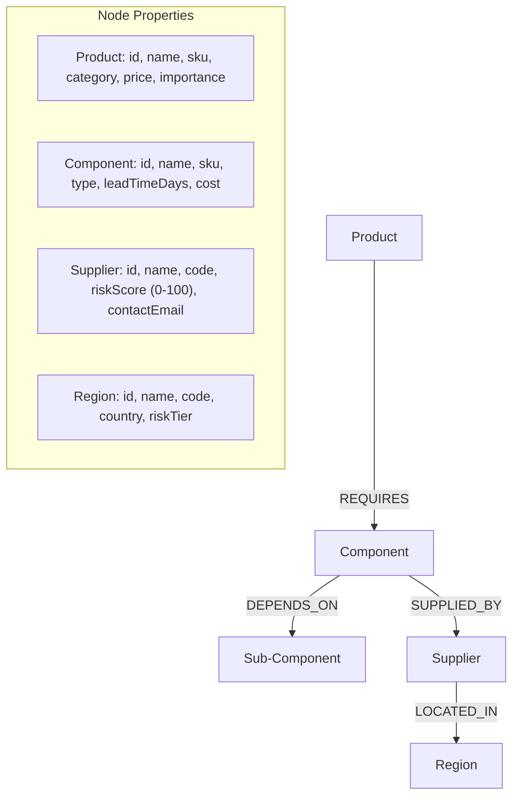

# Supply Chain Risk Analyzer (CognoDB + Next.js)

A graph-native supply chain risk analysis web application built with **Next.js (App Router, React, TypeScript)** and **Tailwind CSS**, backed by **CognoDB** (open Cypher database over Bolt protocol using `neo4j-driver`).

---

## 🌟 Why a Graph Database? (Graph vs. Relational RDBMS)

In modern manufacturing and aerospace, supply chains are not linear lists—they are complex, deeply interconnected networks. Traditional Relational Databases (RDBMS) struggle with supply chain risk modeling for two fundamental reasons:

1. **Multi-Hop Join Penalty**:
   - In SQL, answering *"Which finished products are affected if Region X goes offline?"* requires joining 4 to 5 tables (`Region` $\rightarrow$ `Supplier` $\rightarrow$ `Component` $\rightarrow$ `SubComponent` $\rightarrow$ `Product`). Each join incurs exponential performance overhead and requires unwieldy `JOIN` queries.
   - In **CognoDB (Cypher)**, relationships are stored as first-class physical pointers (index-free adjacency). Traversing relationships is $O(1)$ per step regardless of total database size.

2. **Recursive Variable-Length Dependencies**:
   - Bill of Materials (BOM) trees have arbitrary nesting depths (e.g. Smartphone $\rightarrow$ SoC $\rightarrow$ Silicon Wafer $\rightarrow$ EUV Optics). In SQL, querying variable-depth trees requires complex recursive CTEs (`WITH RECURSIVE`), which are slow and hard to maintain.
   - In **Cypher**, variable-depth traversal is a native single-line clause: `(p:Product)-[:REQUIRES|DEPENDS_ON*1..8]->(c:Component)`.

---

## 📐 Data Model Diagram



---

## 🚀 Key Cypher Queries Used in the Code

All queries in this application are strictly **parameterized via `neo4j-driver`** to prevent Cypher injection vulnerabilities and ensure optimal query plan caching.

### 1. Multi-Hop Regional Outage Traversal (3–4 Hops)
Finds all suppliers in a region, blocked components, and downstream impacted products:

```cypher
MATCH (r:Region {id: $regionId})
OPTIONAL MATCH (s:Supplier)-[:LOCATED_IN]->(r)
OPTIONAL MATCH (c:Component)-[:SUPPLIED_BY]->(s)
OPTIONAL MATCH path = (p:Product)-[:REQUIRES|DEPENDS_ON*1..5]->(c)
WITH r, 
     collect(DISTINCT s) AS suppliers, 
     collect(DISTINCT c) AS components, 
     collect(DISTINCT p) AS products
RETURN r AS region, 
       suppliers, 
       components, 
       products,
       size(products) AS impactedProductCount
```

### 2. Variable-Length Deep BOM Dependency Tree (RDBMS Awkward Query)
Traces arbitrary depth sub-component hierarchies for finished products:

```cypher
MATCH (p:Product {id: $productId})
OPTIONAL MATCH path = (p)-[:REQUIRES|DEPENDS_ON*1..8]->(c:Component)
OPTIONAL MATCH (c)-[subRel:SUPPLIED_BY]->(s:Supplier)-[:LOCATED_IN]->(r:Region)
RETURN p AS product,
       c AS component,
       length(path) AS depth,
       s AS supplier,
       r AS region,
       subRel.isPrimary AS isPrimarySupplier,
       subRel.unitPrice AS unitPrice
ORDER BY depth ASC, c.name ASC
```

### 3. Single Point of Failure (SPOF) Detection
Identifies single-sourced components or high-risk supplier concentrations:

```cypher
MATCH (c:Component)-[:SUPPLIED_BY]->(s:Supplier)-[:LOCATED_IN]->(r:Region)
WITH c, collect({supplier: s, region: r}) AS supplierList
WHERE size(supplierList) = 1 OR any(item IN supplierList WHERE item.supplier.riskScore >= $minRiskScore)
OPTIONAL MATCH (p:Product)-[:REQUIRES|DEPENDS_ON*1..5]->(c)
WITH c, supplierList, collect(DISTINCT p) AS affectedProducts
RETURN c AS component, 
       supplierList[0].supplier AS primarySupplier,
       supplierList[0].region AS supplierRegion,
       size(supplierList) AS totalSupplierCount,
       affectedProducts
ORDER BY primarySupplier.riskScore DESC
```

---

## 🛠️ Setup & Running Instructions

### 1. Prerequisites
- Node.js 18+ & npm
- A running **CognoDB** instance (or Neo4j database instance) supporting Bolt 5.0+

### 2. Clone & Install Dependencies
```bash
git clone <repository-url>
cd supply-chain-risk-analyzer
npm install
```

### 3. Configure Environment Variables
Create `.env.local` in the root directory:

```env
NEO4J_URI=bolt://localhost:7687
NEO4J_USERNAME=cognodb
NEO4J_PASSWORD=your_cognoDB_password
```
*(Note: `NEO4J_USERNAME` is strictly set to `"cognodb"` per assignment specifications).*

### 4. Seed the Graph Database
Run the Node.js TypeScript seed script to clear and populate realistic graph data:

```bash
npm run seed
```

### 5. Start Development Server
```bash
npm run dev
```

Open [http://localhost:3000](http://localhost:3000) in your browser.

---

## 📸 Screenshots & Live Demo

- **Live Demo**: [https://graph-self-three.vercel.app](https://graph-self-three.vercel.app)

### Dashboard Overview


### Region Outage Simulator


### Interactive Graph Canvas


---

## 📁 Project Structure

```
├── app/
│   ├── api/
│   │   ├── health/route.ts                # CognoDB connection & count check
│   │   ├── overview/route.ts              # Dashboard high-level metrics
│   │   ├── seed/route.ts                  # UI-triggered DB re-seed endpoint
│   │   └── risk-analysis/
│   │       ├── region-outage/route.ts     # Multi-hop blast-radius traversal
│   │       ├── bom-tree/route.ts          # Variable-length path BOM traversal
│   │       └── spof/route.ts              # Single Point of Failure scanner
│   ├── globals.css                        # Glassmorphism dark-mode CSS
│   ├── layout.tsx                         # Root app layout
│   └── page.tsx                           # Main Dashboard page
├── components/
│   ├── Header.tsx                         # Header with DB health status badge
│   ├── StatsOverview.tsx                  # Metric cards
│   ├── RegionOutageSimulator.tsx          # Multi-hop blast-radius explorer
│   ├── BomDependencyExplorer.tsx          # Variable-length path explorer
│   ├── SpofRadar.tsx                      # Single point of failure scanner
│   ├── SupplyChainGraphVisualizer.tsx     # Custom SVG interactive graph canvas
│   ├── CypherQueryInspector.tsx           # Parameterized Cypher query inspector
│   ├── LoadingSkeleton.tsx                # Skeleton loading states
│   ├── EmptyState.tsx                     # Empty state handler
│   └── ErrorAlert.tsx                     # Database error alert
├── lib/
│   └── neo4j.ts                           # Driver setup, session management & deserializer
├── scripts/
│   └── seed.ts                            # Node.js seed script for graph data
├── .env.example                           # Sample environment configuration
├── package.json                           # Dependencies & run scripts
├── tsconfig.json                          # TypeScript configuration
└── README.md                              # Comprehensive Documentation
```
